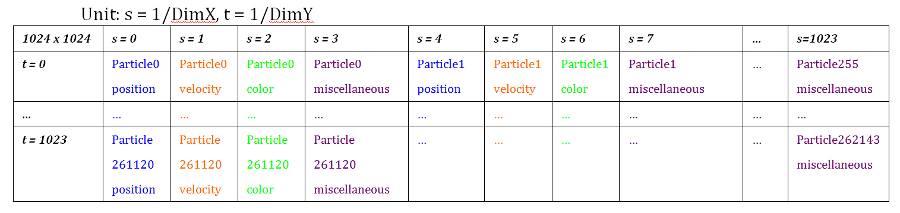
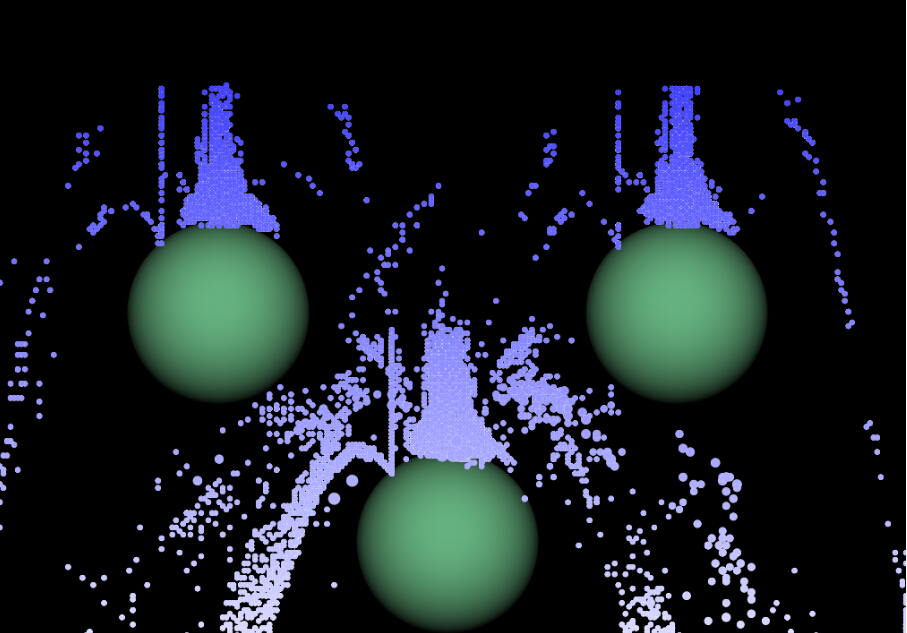

#WebGL Particle Simulation System
By Zhen Gou, Zhenghan Mei

##Overview
This is a particle system developed using WebGL which has the following major features: simulation in fragment shader, collision handling with obstacles, user editable obstacles, deferred shading, velocity based motion blur.

[Demo] (https://gouzhen1.github.io/WebGL-Particle-System)

if your browser cannot run it, here is a video demo

[video](http://www.youtube.com/watch?v=0AAPv1RNVgg&feature=youtu.be)

##Implementation Explanation

###Framework
We built our own framework using Igloo as the wrapper API for WebGL.

###Workflow
There are 2 passes for each frame. 

* 1. Simulation Pass

The simulation of particles are done in fragment shader for maximal performance by taking advantage of the massive parallel on GPU so that the simulation for each particle are computed in parallel. To achieve this, states of particles have to be stored in textures. Two textures to be precise, one texture that stores the states of the particles in the previous frame and another texture to store the updated states of the particles. The following diagram explains how we packed the particle state into a texture. Each particle uses 4 texels, so a 1024 x 1024 texture can store up to ~250,000 particles.

Illustration of data packing for a 1024 x 1024 texture

Since we support collisions of particles with obstacles, we need to provide the shader with a 3rd texture that stores all the information of obstacles in the scene.

-	VBO: a quad covers whole screen

-	Framebuffer: current state texture

-	Uniforms: previous state texture and other miscellaneous parameters.s

-  	vertex shader (quad.vert): trivial

-  	fragment shader (simulation.frag) :

* update: Each fragment corresponds to a texel in our particle state texture. Thus the job for each fragment is to update the state for that texel. First, the fragment has to figure out what state it is updating (e.g. position? Velocity?) by checking its gl_Fragcoord. After that, it computes the new state by an explicit Euler step and store the new state in the current state texture by setting glFragColor to the new state.

* Collision detection: 

collision detection is done when a fragment is updating the velocity state of a particle. We developed 2 ways of detecting collision.

* a. brute-force loop through obstacles passed in through texture

 This way of detection only supports obstacles that are all spheres. The fragment will first find the position of the particle and then searches through the obstacle state texture to find is the particle within the radius of any spheres.
 One of the problem of this approach is the limit on number of obstacles because GLSL limits the amount of instructions in the shader, so once number of obstalces reach a number the following error will be caused.

![] (error.jpg)

* b. pre-computed level-set

In this way, we discretized our space into DimX * DimY grids, and before our simulation begins, our program will loop through obstacles (both primitives and OBJ mesh) to generate the levelset.

Using this way of collision detection, we sacrificed loading speed but greatly accelerated run-time collision detection, O(1) to be precise. 

Detailed analysis of the 2 different approach can be found in performance analysis.

* Collision handling: 

Once collision is detected, it computes a repelled velocity for the particle using the following method.
Say we have incoming velocity I, surface normal N, we first compute the direction of the repelled velocity R  =  (reflect(I,N) + N)/| reflect(I,N) + N|, then we compute the speed depending on how far is the particle penetrating the sphere. The reason we use the half vector between the reflected direction and the normal is to avoid the formation of spirals.
The following diagram illustrates how collision is handled

![] 

   Numerical Precision problem: since we store states in a texture, where each channel is 8-bits (there’s floating point channel available, but lot of machine doesn’t support it), so for position and velocity, each component, x,y,z can only have 256 different values. This lack of precision creates big problem especially obvious in collision handling. For example, for particles that come straight from above the middle of the sphere will bounce up and down forever, illustrated by the following image, because the repelled velocity has direction that is extremely close to the normal of the surface and this difference cannot be differentiated given this poor numerical precision.

To solve this problem, we added noise to the repelled velocity and the resulting simulation looks much more natural.

with noise

![] (fixed.png)

* 2.Display pass

-	VBO: an index array for particles (each index corresponds to one particle)

-	Framebuffer:  default framebuffer

-	Uniforms: current state texture and other miscellaneous parameters

-  	vertex shader (draw.vert): reads the position of the particle given the index, set glPosition to the particle position and set glPointSize appropriately.

-  	fragment shader (display.frag) : set color according to particle state

###Performance analysis
obstacle state loop v.s levelset
![] (table1.jpg)
![] (table2.jpg)
![] (table3.jpg)
![] (table4.jpg)
